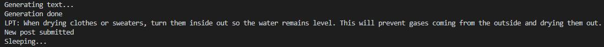

# Reddit Bot - LifeProTips

I detta projekt har jag tränat en model på inlägg på subredditen LifeProTips, så att den kan skapa egna inlägg. Detta gör jag sedan till en bot som lägger ut sina egen-genererade inlägg på Reddit. Såhär kan ett inlägg se ut:


## Files
* **data.txt** - Varje rad är ett inlägg. Titeln och texten separeras av "\*\*\*\*\*". Detta så att modellen kan tränas för att både skapa titeln och text.
* **train.py** - Tränar en modell på data i data.txt.
* **model_bot.py** - Innehåller funktioner för att generera text via modellen, och för att se om den genererade texten finns i data.txt
* **bot.py** - Använder funktionerna i **model_bot.py** och lägger upp inlägg på Reddit under godtyckliga intervall.

## Usage
För att kunna använda denna bot på ditt egna reddit konto, måste du skapa en Reddit applikation på sidan [https://www.reddit.com/prefs/apps/](https://www.reddit.com/prefs/apps/). Byt ut mina client-id och client-secret på filen **bot.py** med dina client-id och client-secret som du fick när du skapade applikationen. Byt också ut mina inloggningsuppgifter med dina. Titta gärna på [denna](https://www.pythonforengineers.com/build-a-reddit-bot-part-1/) guide för att förstå mer om hur du får ditt client-id och client-secret. Du kan nu välja vilken subreddit botten ska köras i, alltså var den kommer att göra sina inlägg, med hjälp av variabeln "subreddit" i filen **bot.py**. I mitt fall gör den sina inlägg i subredditen "BotsParadise", som är en egengjord subreddit för testning. När du har lagt till client-id, client-secret samt subreddt, är det bara att köra filen **bot.py**, för att få botten att köras. Ett lyckat post kan se ut såhär i terminalen:

### Dependencies
* praw ``` pip install praw==6.5.1```
* gpt_2_simple ``` pip install gpt_2_simple==0.7.1 ```
* tensorflow 1.14.0 ``` pip install tensorflow==1.14.0```

## How it works
### Preprocessing
Innan man ens kan börja skriva någon kod behövs det att man införskaffar data och formaterar det på rätt sätt. I just detta projekt införskaffades datan via biblioteket **praw**. Med det kunde ett program iterera igenom tiotusentals inlägg från subredditen "LifeProTips". Datan formaterades i en txt-fil, där varje rad representerades av ett inlägg på följande sätt:<br>
**TITLE** \*\*\*\*\* **BODY**<br>
Detta gjordes eftersom då modellen tränas, ska den använda sig av dessa stjärnor för att kunna separera titel och body.
### Functions
I filen **model_bot.py** finns alla funktioner som sedan används av **bot.py**. Framförallt finns funktionen **generate_text** som genererar fem stycken inlägg, och väljer ut en av dem. Den fungerar genom att använda biblioteket **gpt_2_simple** och den modellen som tränades. När den har skapat fem olika inlägg, itererar den igenom dessa inlägg och ser om de är behöriga inlägg. Alltså att titeln börjas med "LPT:", att de fem stjärnorna finns med i hela texten och att den inte har kopierat något från datafilen. Sedan itererar den igenom de behöriga inläggen och väljer den kortaste. Detta eftersom den kortaste tenderar att vara den mest sammanhängande. Om inga behöriga inlägg finns, returnerar den sig själv. Annars returnerar den inlägget i ett fördelsaktigt format i en dictionary. En annan funktion som finns i **model_bot.py** är **makeNewPost**, som postar inlägget på reddit.
### The bot
**bot.py** är filen som kör själva botten. Den autentiserar redditkontot och kör sedan en "while True" loop, som bara kan avslutas genom att avbryta processen. I loopen skapas ett inlägg, postas det inlägget och sedan sover programmet i **sleeptime** sekunder, för att sedan göra samma sak igen.

## Problems and solutions
* Ett problem jag stötte på när jag skapade denna bot var att den ofta skapade alldeles för långa inlägg. Den kunde fortsätta i flera hundra ord, ofta med många upprepningar. Jag löste detta genom att skapa flera inlägg vid varje cykel, och välja den som var kortast.
* Ett annat problem som uppstod vid införskaffningen av datan var att biblioteket **praw** bara kunde ge tillbaka 50 inlägg från subredditen "LifeProTips". Detta gjorde att mitt dataset bara var 50 rader lång, och att modellen inte blev bra på att generera inlägg. Jag löste detta genom att låta ett skript köra över en natt, där varje gång ett inlägg las ut på subredditen, la den till en rad i dataset filen. Tillslut blev filen 1000 rader lång, vilket gjorde modellen mycket bättre.

## Future developments
Projektet kan till exempel utvecklas genom att få botten att svara på kommentarer den får på sitt inlägg. 
